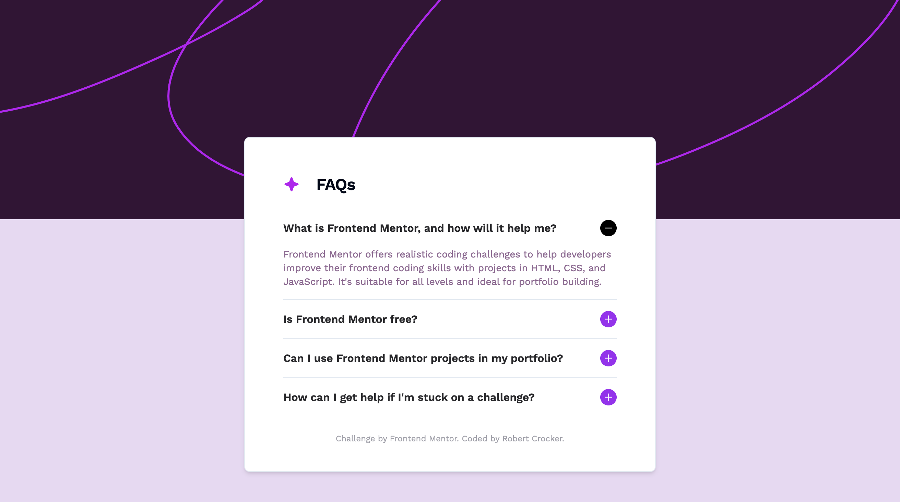

# Frontend Mentor - FAQ accordion solution

This is a solution to the [FAQ accordion challenge on Frontend Mentor](https://www.frontendmentor.io/challenges/faq-accordion-wyfFdeBwBz). Frontend Mentor challenges help you improve your coding skills by building realistic projects.

## Table of contents

- [Overview](#overview)
  - [The challenge](#the-challenge)
  - [Screenshot](#screenshot)
  - [Links](#links)
- [My process](#my-process)
  - [Built with](#built-with)
  - [What I learned](#what-i-learned)
  - [Useful resources](#useful-resources)
- [Author](#author)
- [Acknowledgments](#acknowledgments)

## Overview

### The challenge

Users should be able to:

[x] Hide/Show the answer to a question when the question is clicked
[x] Navigate the questions and hide/show answers using keyboard navigation alone
[x] View the optimal layout for the interface depending on their device's screen size
[x] See hover and focus states for all interactive elements on the page

### Screenshot

### Links

- Live Site URL: [FAQ Accordion](https://faq-accordion-rust.vercel.app/)

## My process

### Built with

- [Tailwind CSS](https://tailwindcss.com/)
- [Shadcn/ui](https://ui.shadcn.com/)
- [NextJS](https://nextjs.org/)
- [React](https://reactjs.org/)
- [Next.js](https://nextjs.org/)

### What I learned

I hadn't appreciate the benefits of bring the ShadUI components into my repo before, but it's great having full control over that code. At first, I was trying to work with them as I would another UI library like MUI or Chakra, but with Shadcn/UI all the code is in your repo and it's just React styled with Tailwind. Another big win of using the stack I did was the ease of make the accordion accessible. That would have take much longer to do if I was leveraging Shadcn/UI.

### Useful resources

- [How to use Local Fonts with Next](https://www.youtube.com/watch?v=L8_98i_bMMA) - This was a helpful YouTube video to watch to see how to use local fonts or Google fonts.

## Author

- Frontend Mentor - [@robcrock](https://www.frontendmentor.io/profile/robcrock)
- Twitter - [@robcrock](https://twitter.com/robcrock)

## Acknowledgments

This was helpful for installing and easily using the font https://www.youtube.com/watch?v=L8_98i_bMMA

This is where you can give a hat tip to anyone who helped you out on this project. Perhaps you worked in a team or got some inspiration from someone else's solution. This is the perfect place to give them some credit.
